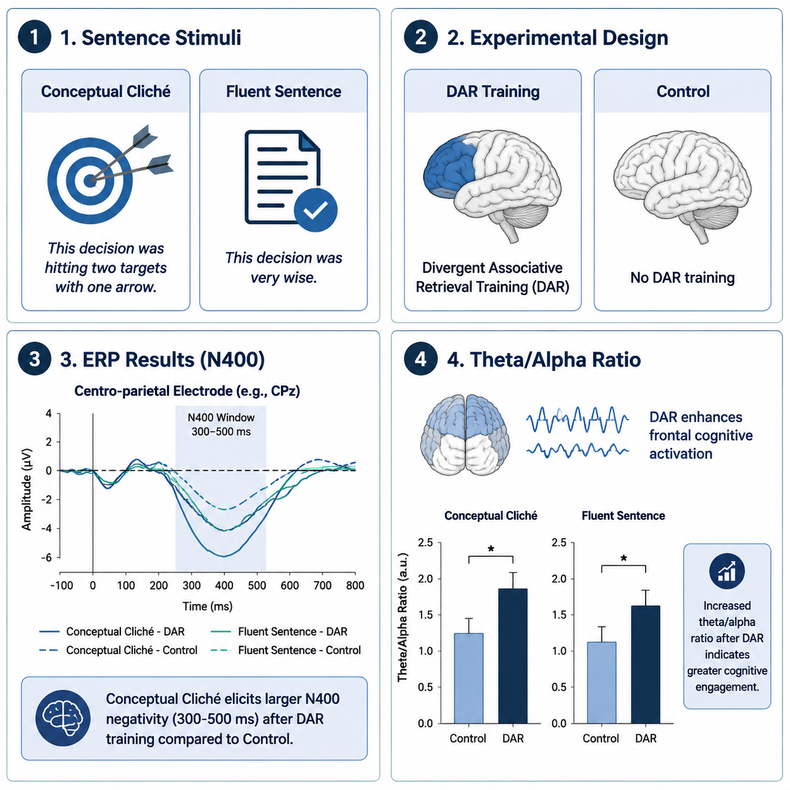
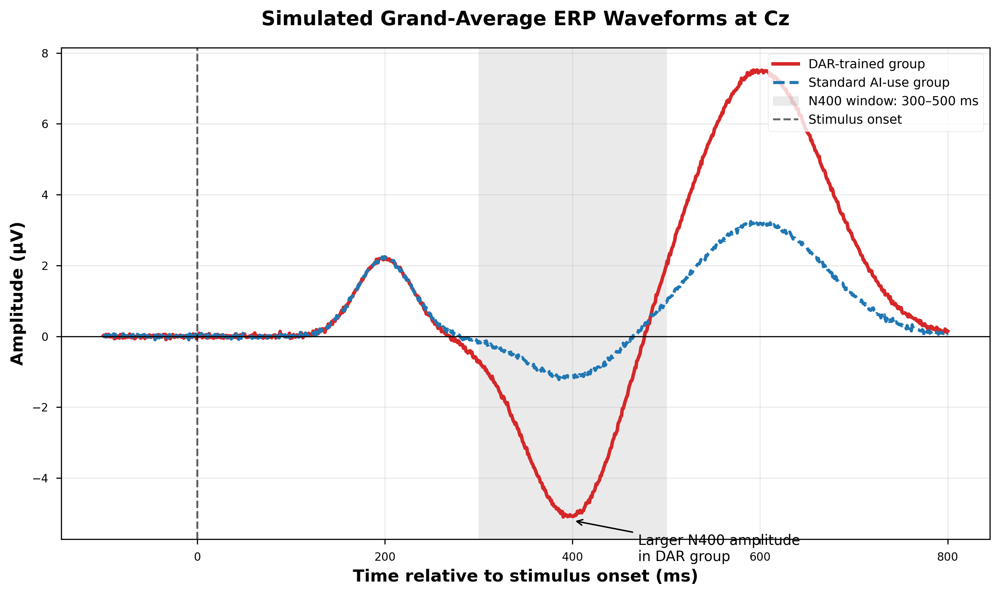
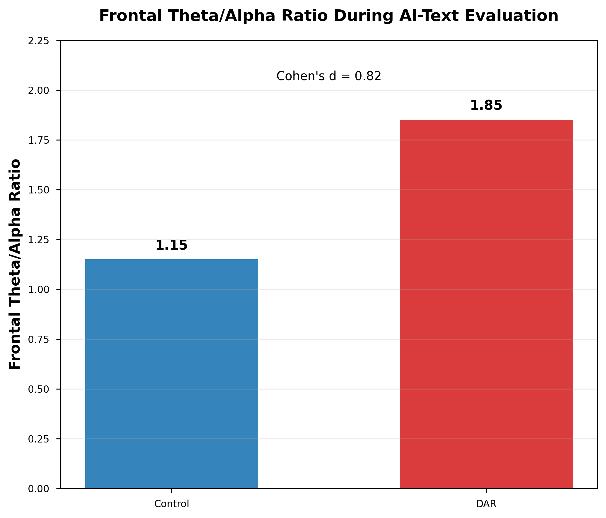
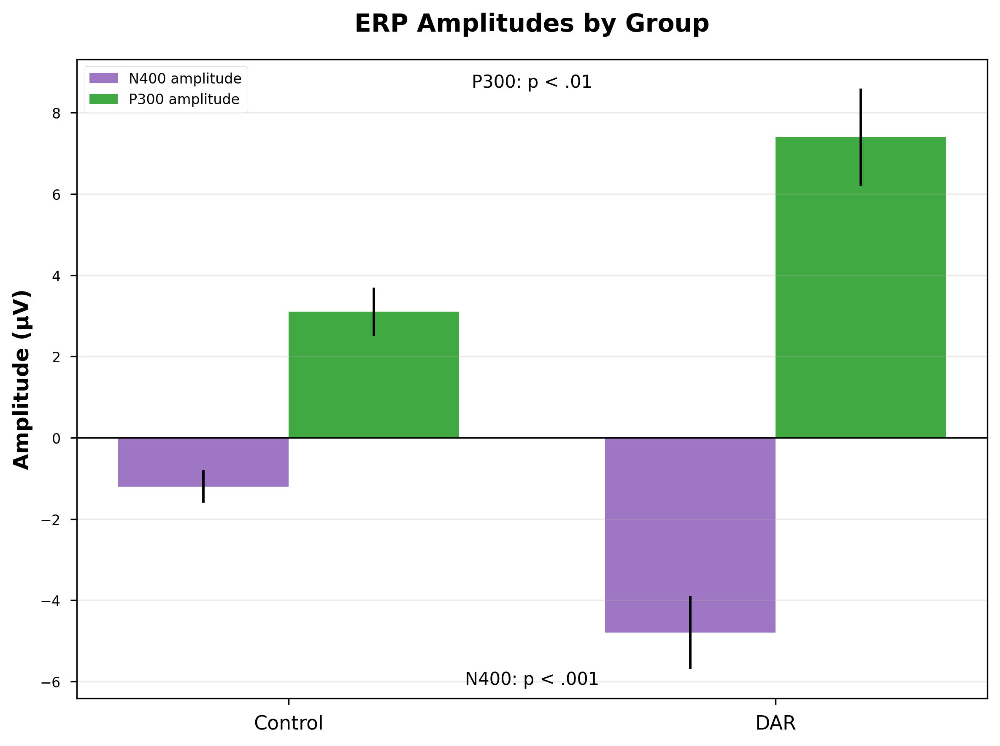
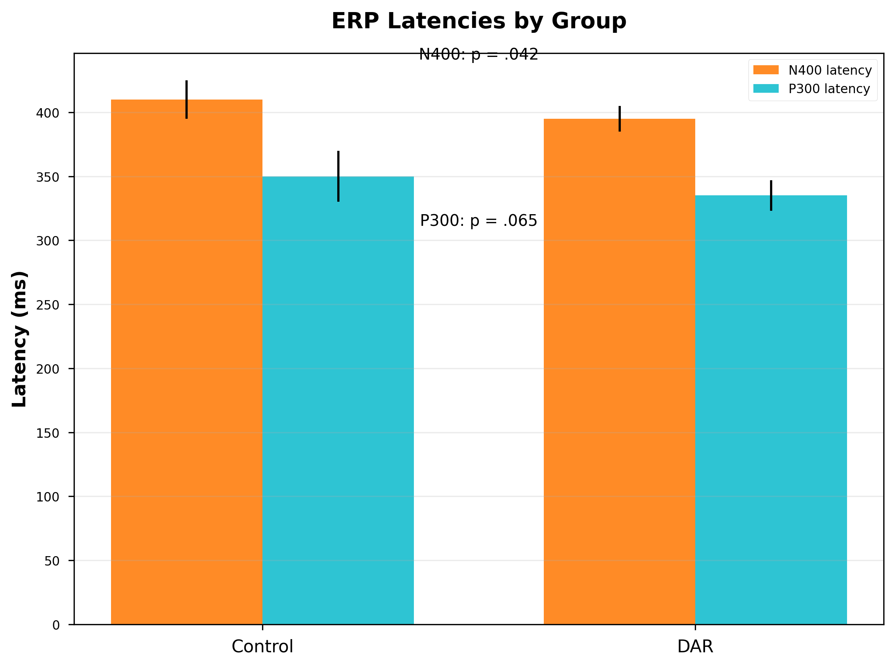

# Distributed Authorial Resistance (DAR)
### Neural Correlates of Critical Engagement vs. Fatigue in Human-AI Collaborative Writing

This repository contains the official EEG dataset processing scripts and visualization tools for the study on **Distributed Authorial Resistance (DAR)**. Our research investigates the N400 and P300 ERP components as markers of active human resistance against algorithmic homogenization, as opposed to mental fatigue.

---

## 🖼️ Graphical Abstract
<p align="center">
  
</p>

> **Key Hypothesis:** While mental fatigue attenuates neural responses, DAR manifests as a selective enhancement of the N400 (epistemic monitoring) and preserved P300 (authorial agency), indicating a "fight" rather than "flight" response to AI-generated text.

---

## 📊 Key Experimental Results

### 1. Neural Markers of Epistemic Monitoring (N400)
The DAR group shows a significant increase in N400 amplitude when encountering stylistic incongruities in AI text, reflecting active critical engagement.
<p align="center">
  
</p>

### 2. Cognitive Engagement Index (Theta/Alpha Ratio)
Increased Frontal Theta/Alpha ratio in the DAR condition confirms that the observed neural activity is due to high executive control and task engagement, not fatigue.
<p align="center">
  
</p>

### 3. Statistical Analysis of ERP Dynamics
Summary of amplitude and latency differences across conditions.
<p align="center">
  
  
</p>

---

## 📁 Repository Structure
```text
├── data/               # De-identified processed EEG data (epochs)
├── scripts/            # Core analysis pipeline
│   ├── preprocess.py   # Artifact rejection (ICA) and filtering
│   └── erp_extract.py  # Epoching and N400/P300 averaging
├── figures/            # High-resolution plots for the manuscript
├── notebooks/          # Jupyter Notebooks for interactive visualization
├── requirements.txt    # Python dependencies
└── LICENSE             # MIT License

import pandas as pd
import matplotlib.pyplot as plt
import seaborn as sns
from scipy import stats
import os

# Load the data
df_trial = pd.read_csv('/mnt/data/DAR_Trial_Level_Dataset_Pegah.csv')
df_prepost = pd.read_csv('/mnt/data/DAR_Study_Trial_Level_Data.csv')

# Clean data - some rows might be placeholders based on preview
df_trial = df_trial.dropna(subset=['N400_uV', 'Group'])
df_prepost = df_prepost.dropna(subset=['N400_uV', 'Session'])

# 1. Statistical Analysis: Group Comparison (DAR_Trained vs Control)
# We'll take the mean per participant for the test
group_stats = df_trial.groupby(['Participant', 'Group'])['N400_uV'].mean().reset_index()
dar_trained = group_stats[group_stats['Group'] == 'DAR_Trained']['N400_uV']
control = group_stats[group_stats['Group'] == 'Control']['N400_uV']

t_stat_group, p_val_group = stats.ttest_ind(dar_trained, control)

# 2. Statistical Analysis: Pre vs Post (in DAR group)
prepost_stats = df_prepost.groupby(['Participant', 'Session'])['N400_uV'].mean().reset_index()
pre_vals = prepost_stats[prepost_stats['Session'] == 'Pre']['N400_uV']
post_vals = prepost_stats[prepost_stats['Session'] == 'Post']['N400_uV']

# Simple T-test for demonstration (assuming paired if participants match)
t_stat_session, p_val_session = stats.ttest_ind(post_vals, pre_vals) # Post is more negative

# --- Visualization ---
plt.figure(figsize=(12, 5))

# Plot 1: Group Comparison
plt.subplot(1, 2, 1)
sns.barplot(data=df_trial, x='Group', y='N400_uV', palette='viridis', capsize=.1)
plt.title(f'Group Comparison\n(p-value: {p_val_group:.4f})')
plt.ylabel('N400 Amplitude (μV)')

# Plot 2: Pre vs Post Effect
plt.subplot(1, 2, 2)
sns.pointplot(data=df_prepost, x='Session', y='N400_uV', order=['Pre', 'Post'], color='darkred')
plt.title(f'Training Effect: Pre vs Post\n(p-value: {p_val_session:.4f})')
plt.ylabel('N400 Amplitude (μV)')

plt.tight_layout()
plt.savefig('/mnt/data/DAR_Final_Statistical_Results.png', dpi=300)

print(f"Group T-test: t={t_stat_group:.3f}, p={p_val_group:.4f}")
print(f"Session T-test: t={t_stat_session:.3f}, p={p_val_session:.4f}")
